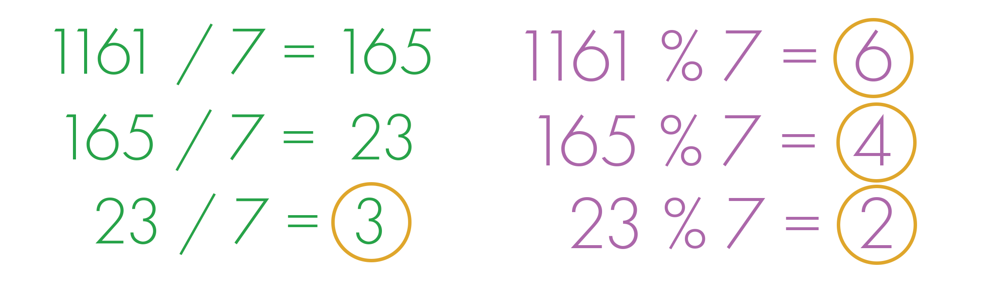

  <h1>Module 4</h1>
     

      

## Number Representation
- Decimal notation is base 10: 0, 1, 2, 3, 4, 5, 6, 7, 8, 9
- Binary notation is base 2: 0, 1

Decimal →
1308 = 1 x 103 + 3 x 102 + 0 x 101 + 8 x 100

Binary →
1010 = 1 x 23 + 0 x 22 + 1 x 21 + 0 x 20

## Converting fromn Base B to Decimal
(2012)3   
= 2 x 33 + 0 x 32 + 1 x 31 + 2 x 30   = 2 x 27 + 0 x 9 + 1 x 3 + 2 x 1   = 59

## Hexadecimal Numbers

### Hexadecimal Conversion Table

| Hexadecimal | Decimal | Binary   |
|------------|---------|----------|
| 0          | 0       | 0000     |
| 1          | 1       | 0001     |
| 2          | 2       | 0010     |
| 3          | 3       | 0011     |
| 4          | 4       | 0100     |
| 5          | 5       | 0101     |
| 6          | 6       | 0110     |
| 7          | 7       | 0111     |
| 8          | 8       | 1000     |
| 9          | 9       | 1001     |
| A          | 10      | 1010     |
| B          | 11      | 1011     |
| C          | 12      | 1100     |
| D          | 13      | 1101     |
| E          | 14      | 1110     |
| F          | 15      | 1111     |

(3B2)16  
= 3 x 162 + B x 161 + 2 x 160  
= 3 x 256 + 11 x 16 + 2 x 1  
= 946

## Converting from Decimal to Base B

Given 1161 in decimal, convert to base 7: 
Steps:
1) Take the number (1161) and divide it by the base (7)
2) Take the remainder (6) and write it down
3) Take the quotient (165) and divide it by the base (7)
4) Take the remainder (4) and write it down
5) Repeat until the quotient is smaller than the base

To obtain your result, grab the remainders from bottom to top. In this case, the result is (3246)7

## Signed Binary Number Encoding

## Signed Magnitude

## Converting Signed Binary to Decimal

## Two's Complement

## Converting from Decimal to Two's Complement

## Converting Negative Decimal to Two's Complement

## Converting from Two's Complement to Decimal

## Additionof Two Unsigned Binary Numbers

## Addition of Two Signed Binary Numbers

## Bitwise Operators

## Bitwise Operations 

## Bit Shifting

